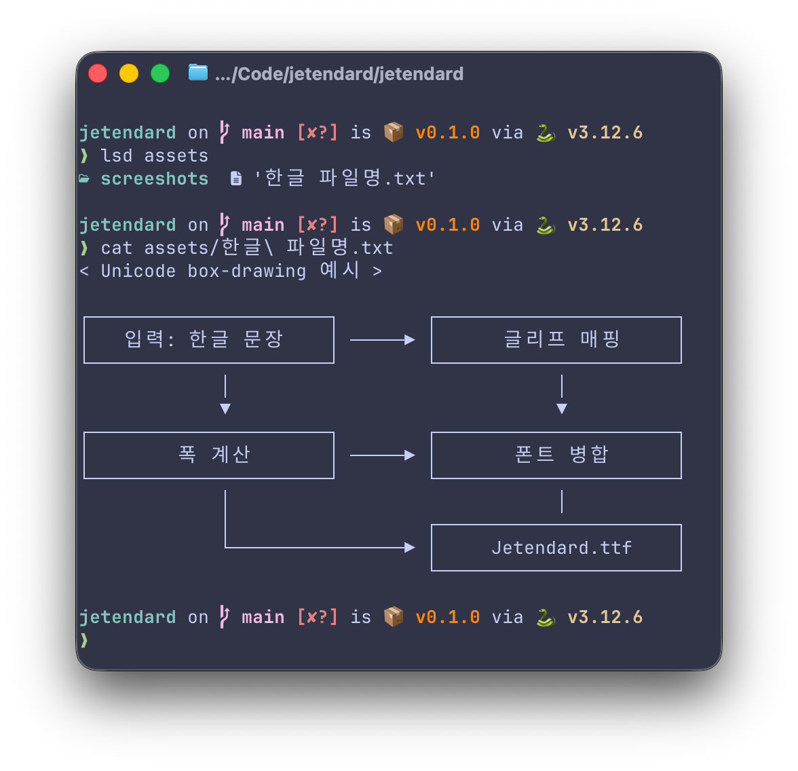

# Geistendard

This branch builds a terminal/IDE-focused hybrid font: Geist Mono for Latin
glyphs, Pretendard for Korean/CJK glyphs, Jetendard's fitting and metadata
pipeline, and an optional Nerd Fonts patching step for terminal symbols.

It keeps the Jetendard treatment that fits Korean/CJK glyphs into exactly two
Latin monospace advances, but changes the default Latin source back to
[Geist Mono](https://github.com/vercel/geist-font/tree/main/fonts/GeistMono).
The default Korean scale is `1.10`, chosen as a smaller terminal-friendly
middle ground than Jetendard's previous `1.15`.

The generated family is named `Geistendard` by default. Nerd Font symbols are
added after the TTF build with `make nerd`, because the default Geist Mono
source is not pre-patched.

**Zed Editor (font size 13.5)**


**Zed Editor (Korean comments)**


**Ghostty Terminal (Text Output)**


**Ghostty Terminal (Codex)**


## Build

```bash
uv sync --all-groups
make download
make run
make nerd
make test
```

`make run` builds every upright Geist Mono weight supported by this builder.
`make nerd` patches the generated TTF files into `fonts/nerd-font`; it requires
FontForge, `curl`, and `unzip`.

Generated files are written to:

- `fonts/ttf/Geistendard-*.ttf`
- `fonts/otf/Geistendard-*.otf`
- `fonts/webfont/Geistendard-*.woff2`
- `fonts/webfont/geistendard.css`
- `fonts/nerd-font/*` after `make nerd`

Generated outputs and upstream downloads are intentionally ignored by git.

## CLI

```bash
uv run jetendard --help
```

Important options:

- `--latin-source`: `geist` by default; `jetbrains-nerd` remains available for
  the original JetBrainsMono Nerd Font Mono source profile
- `--latin-dir`: directory containing Latin source TTF files; defaults depend on
  `--latin-source`
- `--cjk-dir`: directory containing `Pretendard-*.ttf`
- `--all`: build every variant supported by the selected Latin source profile
- `--variants`: explicit output variants such as `Regular`, `Light`, or `Bold`
- `--weights`: weights to build; without `--styles`, this selects upright variants
- `--styles`: `normal`, `italic`, or both; the default Geist source supports
  `normal` only
- `--korean-italic-mode`: Korean/CJK policy for italic variants, currently `upright`
- `--korean-scale`: visual scale for Korean/CJK glyph fitting
- `--scale`: compatibility alias for `--korean-scale`

The default Korean scale is `1.10`.

Examples:

```bash
uv run jetendard --all
uv run jetendard --variants Regular Light Bold
uv run jetendard --latin-source jetbrains-nerd --weights Regular Bold --styles normal italic
```

## Variant Coverage

The default `geist` profile builds upright variants only:

| Weight | Upright | Pretendard Korean/CJK source |
| --- | --- | --- |
| Thin | `Geistendard-Thin` | `Pretendard-Thin` |
| ExtraLight | `Geistendard-ExtraLight` | `Pretendard-ExtraLight` |
| Light | `Geistendard-Light` | `Pretendard-Light` |
| Regular | `Geistendard-Regular` | `Pretendard-Regular` |
| Medium | `Geistendard-Medium` | `Pretendard-Medium` |
| SemiBold | `Geistendard-SemiBold` | `Pretendard-SemiBold` |
| Bold | `Geistendard-Bold` | `Pretendard-Bold` |
| ExtraBold | `Geistendard-ExtraBold` | `Pretendard-ExtraBold` |

The optional `jetbrains-nerd` profile keeps the original 16 upright/italic
JetBrainsMono Nerd Font Mono matrix. Geist italic variants are intentionally not
invented by this builder; use a Latin source profile with real italic files if
italic terminal fonts become important.

## Scope

This branch targets terminal and IDE use. The default output prioritizes Geist
Mono Latin rendering, Jetendard's Korean/CJK fitting, and Nerd Font symbols. It
does not try to preserve every original Jetendard release workflow.

## Visual Check Samples

Use the same renderer, point size, and line height when comparing Jetendard
against yeomil-mono or another monospace baseline:

```text
Jetendard 테스트 ABC abc 0123456789
가각간갇갈감갑값같꿇뷁힣
한글과 English가 섞인 source comment
if (상태 === "완료") return "성공";
ㄱㄴㄷㅏㅑㅓㅕㅗㅛㅜㅠㅡㅣ
（）［］｛｝，．：；！？
```

## Release Packaging

The build writes installable files under `fonts/ttf`, `fonts/otf`, and
`fonts/webfont`. Release archives can be prepared from those directories after a
manual visual pass confirms the default Korean scale across upright and italic
variants. The OTF files are OTF-compatible outputs using the same TrueType
outlines as the generated TTFs.

## License

Jetendard is distributed under the [SIL Open Font License 1.1](LICENSE). Review
the upstream JetBrains Mono, Nerd Fonts, Pretendard, and Yeomil Mono projects for
their full copyright and reserved-name notices.
